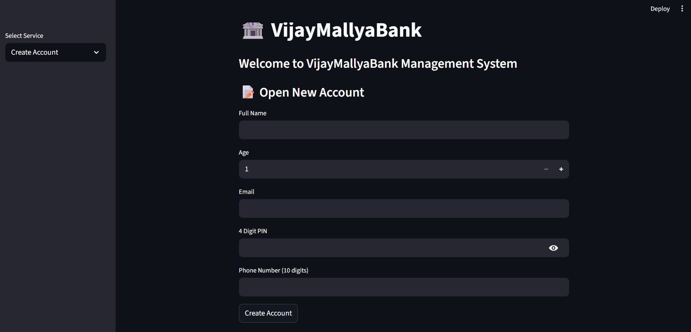

# 🏦 VijayMallyaBank – Bank Management System

A simple bank management system built with **Python** and **Streamlit**. It lets users open an account, deposit and withdraw money, update their details, view their account, and delete it, all from a clean web interface. Data is stored locally in a JSON file.

🔗 **Live Demo:** [Open the app](https://nimishhh21-lena-dena-bank-app-ntdmso.streamlit.app/)



---

## ✨ Features

- **Create Account** – Open a new account with name, age, email, 4-digit PIN and phone number
- **Deposit Money** – Add funds to your account after PIN verification
- **Withdraw Money** – Withdraw funds with balance check and a per-transaction limit of ₹10,000
- **Update Account** – Change your name, email, phone number or PIN
- **View Account Details** – See your account information (PIN is never displayed)
- **Delete Account** – Permanently remove your account, with a confirmation checkbox

## 🔐 Security & Validation

- PINs are **hashed with SHA-256** before being saved, so they are never stored in plain text
- Unique **8-character account numbers** are auto-generated (4 digits + 4 uppercase letters, shuffled)
- Input validation:
  - Name cannot be empty
  - Age must be 18 or older
  - Email must contain `@` and `.`
  - PIN must be exactly 4 digits
  - Phone number must be exactly 10 digits
- Every transaction requires the correct account number and PIN

## 🛠️ Tech Stack

| Technology | Purpose |
|------------|---------|
| Python 3 | Core logic |
| Streamlit | Web user interface |
| JSON | Data storage |
| hashlib | PIN hashing |

## 📁 Project Structure

```
├── app.py                  # Streamlit web app (main version)
├── main.py                 # Original command-line version
├── VijayMallyaBank.json    # Database used by app.py
├── data.json               # Database used by main.py
├── bank.png                # App screenshot
└── README.md
```

## 🚀 Getting Started

### 1. Install dependencies

```bash
pip install streamlit
```

### 2. Run the app

```bash
streamlit run app.py
```

The app will open in your browser at `http://localhost:8501`.

### (Optional) Run the command-line version

```bash
python main.py
```

## 📖 How to Use

1. Open the sidebar and choose a service from **Select Service**.
2. To start, pick **Create Account** and fill in your details. You'll receive a unique account number, so save it.
3. Use your **account number + 4-digit PIN** for every other service.

## 🧱 How It Works

The `VijayMallyaBank` class handles all the data operations:

| Method | Description |
|--------|-------------|
| `save_data()` | Writes all accounts to the JSON file |
| `hash_pin()` | Converts a PIN into a SHA-256 hash |
| `generate_account_number()` | Creates a unique account number |
| `create_account()` | Adds a new user and saves |
| `find_user()` | Verifies account number and PIN |
| `delete_account()` | Removes a user and saves |

## 🔮 Future Improvements

- Transaction history / mini statement
- Money transfer between accounts
- Switch from JSON to a database (SQLite / MySQL)
- Login sessions instead of entering the PIN each time
- Stronger password hashing (e.g. bcrypt with salt)


## 👨‍💻 Author

Made by **Kamran Shahid and Nimish Kushwaha**

---

⭐ If you like this project, give it a star!
